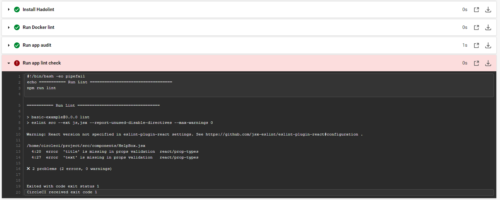
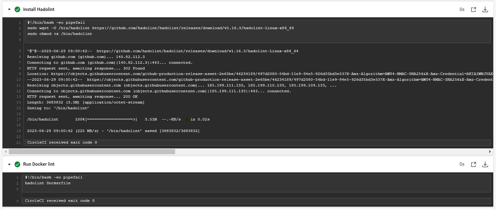
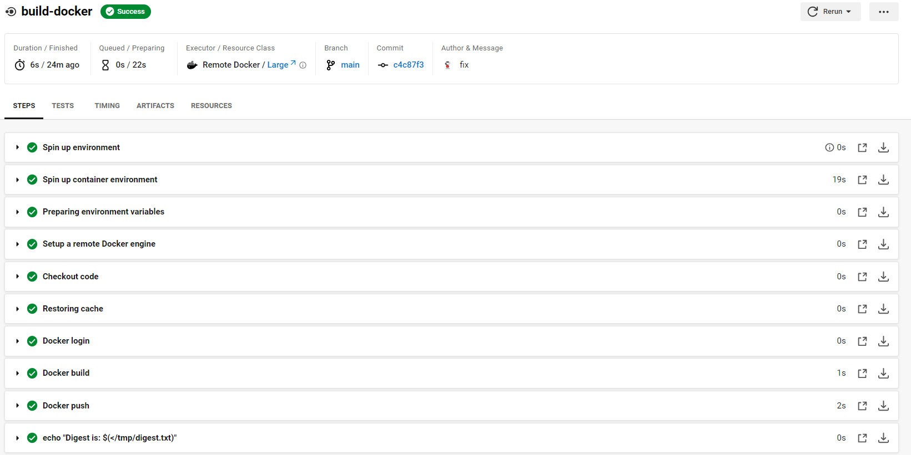
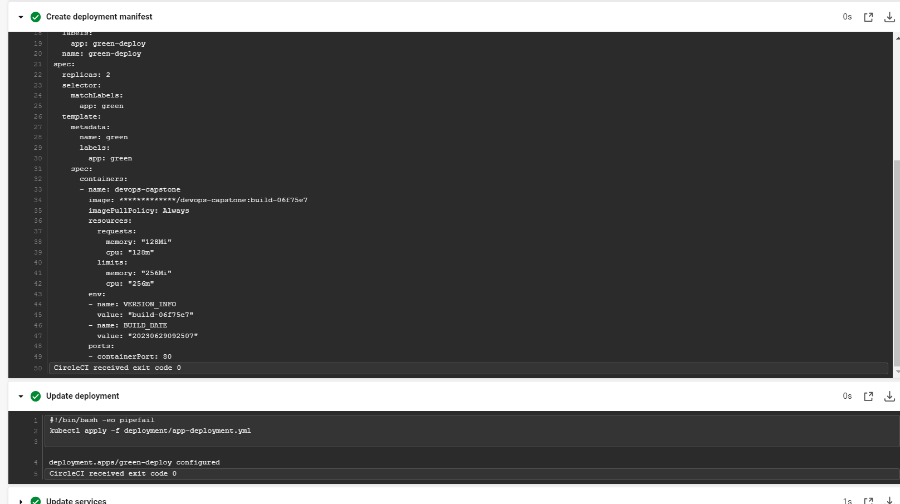
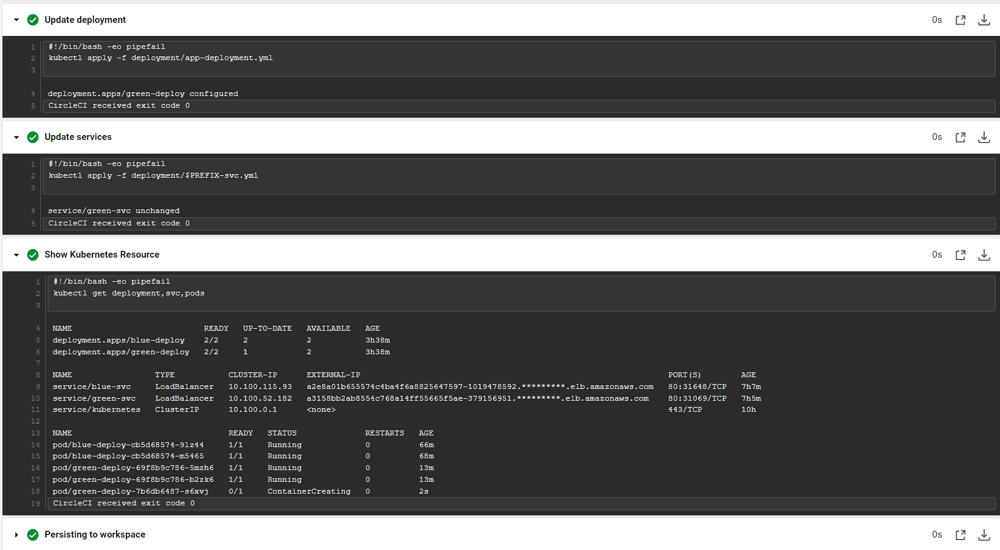

# Capstone - Cloud DevOps : Project Rubric
## CICD Blue/Green Pipeline with Kubernetes
>
** Note: AWS Cloudfront used as router to swich traffic between blue/green 
## Inititlize Kubernetes environment
1. Create kubernetes by eksctl
```
eksctl create cluster --name devops-capstone --region=us-east-1
```
2. Create initial Docker images anf push to repository.Please change docker file path with your account if go run.
```
npm install
npm run build
cd deployment/scripts/
. publish_docker.sh
```
>

3. Apply initial delopment and service for bue-green app
- Make sure env have been created for aws/cli before going run below scripts
```
export AWS_ACCESS_KEY_ID=YOUR_AWS_ACCESS_KEY_ID
export AWS_SECRET_ACCESS_KEY=YOUR_AWS_SECRET_ACCESS_KEY
export AWS_DEFAULT_REGION=us-east-1
```
- Create deployment, svc for blue and green app 
```
. apply_blue_initial.sh
. apply_green_initial.sh
```
>
- Routing cloudfront to blue when initial
```
. route_to_blue.sh
```
>
[cloudfront](dz7gs6n4lyut4.cloudfront.net)
>

# Project Rubric

## Set Up Pipeline

| Criteria    | Specifications |
| :-------- | :------- |
| Create Github repository with project code.  | https://github.com/fuongcao/udacity-devops-capstone    |
| Use image repository to store Docker images | |

## Build Docker Container

| Criteria    | Specifications |
| :-------- | :------- |
| Execute linting step in code pipeline  | Code is checked against a linter as part of a Continuous Integration step (demonstrated w/ two screenshots)<br><br>|
| Build a Docker container in a pipeline | The project takes a Dockerfile and creates a Docker container in the pipeline.<br>     |

## Successful Deployment

| Criteria    | Specifications |
| :-------- | :------- |
| The Docker container is deployed to a Kubernetes cluster | The cluster is deployed with CloudFormation or Ansible. This should be in the source code of the student’s submission.<br>|
| Use Blue/Green Deployment or a Rolling Deployment successfully |The project performs the correct steps to do a blue/green or rolling deployment into the environment selected. Submit the following screenshots as evidence of the successful completion of chosen deployment methodology<br> 1. Screenshot of the Circle CI or Jenkins pipeline showing all stages passed successfully.<br><br><br> 2. Screenshot of your AWS EC2 page showing the newly created (for blue/green) or modified (for rolling) instances running as the EKS cluster nodes.<br><br> - To Rolling back to previus version [./rolling_back.sh](/deployment/scripts/rolling_back.sh)<br><br> 3. Screenshot of the kubectl command output showing that the deployment is successful, pods are running, and the service can be accessed via an external IP or port forwarding.<br><br><br> 4. Screenshot showing that you can access the application after deployment.<br><br>http://a2e8a01b655574c4ba4f6a8825647597-1019478592.us-east-1.elb.amazonaws.com/<br><br>http://a3158bb2ab8554c768a14ff55665f5ae-379156951.us-east-1.elb.amazonaws.com/ |