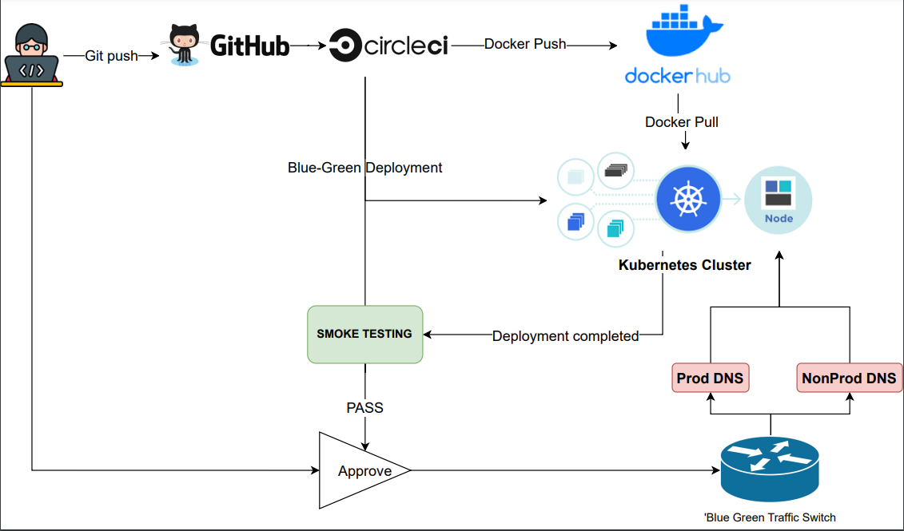

# Capstone - Cloud DevOps : Project Rubric
## CICD Blue/Green Pipeline with Kubernetes
>

## Inititlize Kubernetes environment
1. Create kubernetes by eksctl
```
eksctl create cluster --name devops-capstone --region=us-east-1
```
2. Create initial Docker images anf push to repository.Please change docker file path with your account if go run.
```
npm install
npm run build
cd deployment/scripts/
. publish_docker.sh
```
>

3. Apply initial delopment and service for bue-green app
- Make sure env have been created for aws/cli before going run below scripts
```
export AWS_ACCESS_KEY_ID=YOUR_AWS_ACCESS_KEY_ID
export AWS_SECRET_ACCESS_KEY=YOUR_AWS_SECRET_ACCESS_KEY
export AWS_DEFAULT_REGION=us-east-1
```
- Create deployment, svc for blue and green app 
```
. apply_blue_initial.sh
. apply_green_initial.sh
```
>
- Routing cloudfront to blue when initial
```
. route_to_blue.sh
```
>
[cloudfront](dz7gs6n4lyut4.cloudfront.net)
>


## Set Up Pipeline

| Criteria    | Specifications |
| :-------- | :------- |
| Create Github repository with project code.  | All project code is stored in a GitHub repository and a link to the repository has been provided for reviewers.    |
| Use image repository to store Docker images | The project uses a centralized image repository to manage images built in the project. After a clean build, images are pushed to the repository.     |

## Build Docker Container

| Criteria    | Specifications |
| :-------- | :------- |
| Execute linting step in code pipeline  | Code is checked against a linter as part of a Continuous Integration step (demonstrated w/ two screenshots)    |
| Build a Docker container in a pipeline | The project takes a Dockerfile and creates a Docker container in the pipeline.     |

##Successful Deployment

| Criteria    | Specifications |
| :-------- | :------- |
| The Docker container is deployed to a Kubernetes cluster | The cluster is deployed with CloudFormation or Ansible. This should be in the source code of the student’s submission.    |
| Use Blue/Green Deployment or a Rolling Deployment successfully | The project performs the correct steps to do a blue/green or rolling deployment into the environment selected. Submit the following screenshots as evidence of the successful completion of chosen deployment methodology|